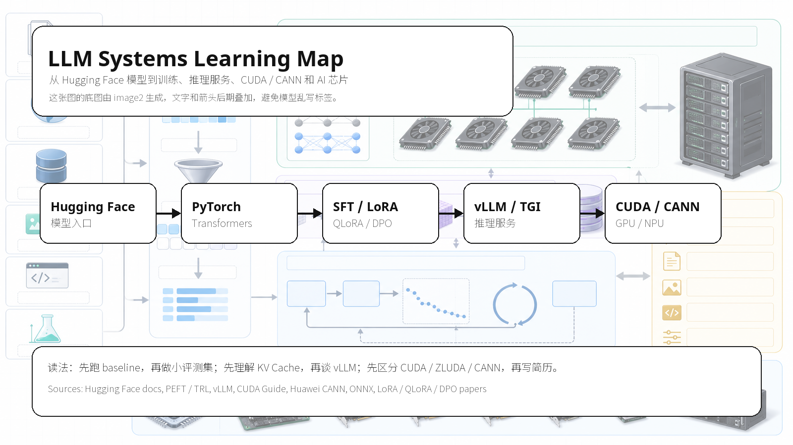

# LLM Systems and AI Chips Tutorial

这是一个面向 LLM systems、AI infra 和 AI chips 的自学教程。

它不追求把所有名词塞进一个仓库。这里的目标更具体：读者能沿着一条工程链路，把模型、数据、评测、推理服务、硬件后端、RAG/Agent 和源码阅读连起来，并且每学完一段都留下一个可检查的输出物。



## 这份教程怎么用

每个主题按同一套方式学习：

```text
先读概念
  -> 跑一个最小脚本或做一张对照表
  -> 记录失败样例
  -> 写一页笔记
  -> 回头检查自己能不能解释清楚
```

不要只收藏链接，也不要只背术语。这个仓库默认你会边读边改，最好每一周都有一个小产出：一张图、一份 benchmark、一页论文笔记、一个源码阅读问题，或者一个可以继续做的 issue/PR 方向。

## 适合谁

- 想从 Hugging Face 模型入门，继续学到推理服务和系统优化。
- 想分清 CUDA、ZLUDA、CANN、ONNX、vLLM、TensorRT-LLM 这些词各自在哪一层。
- 想做一点能放到 GitHub 上的 LLM systems / AI infra / chip learning 练习。
- 想把开源项目阅读变成学习路线，而不是停在 repo 清单。

不适合只想找速成面经、现成简历 bullet 或灰色工具用法的人。

## 课程大纲

| 单元 | 学什么 | 读完要留下什么 |
| --- | --- | --- |
| 0. 课程地图 | 学习顺序、资料来源、怎么自检 | 一份自己的学习路线 |
| 1. 硬件和模型格式 | CUDA、ZLUDA、CANN、ONNX、safetensors、OM | 一张硬件/格式对照表 |
| 2. Hugging Face 到微调 | tokenizer、chat template、SFT、LoRA、QLoRA、DPO | 一个最小推理或 LoRA smoke test |
| 3. 评测和数据 | benchmark、数据清洗、固定评测集 | 20 条小评测样例和清洗报告 |
| 4. 推理和部署 | vLLM、KV cache、量化、并发压测 | 一份 vLLM benchmark 记录 |
| 5. RAG 和 Agent | chunking、retrieval、tool boundary、安全边界 | 一组 RAG 失败样例和安全 checklist |
| 6. 源码阅读和开源提炼 | 从开源项目提取概念、问题和练习 | 一页 source reading note |
| 7. 论文阅读 | systems 论文怎么读成工程问题 | 一页 paper note |

## 推荐阅读顺序

### 第一周：把地图看明白

- [00. 学习地图](docs/00-learning-map.md)
- [00A. 资料来源地图](docs/00-source-map.md)
- [00C. 学习协议](docs/00-study-contract.md)
- [术语表](docs/99-glossary.md)

读完后，先写下自己最想补的三件事：模型微调、推理部署、硬件生态、RAG/Agent、源码阅读，选其中一条继续。

### 第二周：模型和硬件不要混

- [01. CUDA、ZLUDA 与昇腾 CANN](docs/01-hardware-stacks.md)
- [02. PyTorch、ONNX、safetensors 和 OM](docs/02-model-formats.md)
- [11. CUDA / CANN API Map](docs/11-cuda-cann-api-map.md)
- [12. ONNX -> ATC -> OM -> AscendCL](docs/12-onnx-atc-om-flow.md)

输出物：一张 `CUDA / ZLUDA / CANN / ONNX / OM` 边界图。

### 第三周：跑通 Hugging Face baseline

- [03. Hugging Face 项目从哪里开始](docs/03-huggingface-workflow.md)
- [04. SFT、LoRA、QLoRA、DPO 到底在训什么](docs/04-training-finetuning-alignment.md)
- [14. 数据工程与数据清洗](docs/14-data-engineering.md)

配套脚本：

```bash
python examples/minimal_inference.py
python examples/clean_sft_jsonl.py --input raw_sft.jsonl --output temp/clean_sft.jsonl --report temp/clean_sft.report.json
```

输出物：一次最小推理记录和一份数据清洗报告。

### 第四周：评测和推理服务

- [05. 推理优化和部署](docs/05-inference-optimization.md)
- [10. vLLM Benchmark Guide](docs/10-vllm-benchmark-guide.md)
- [13. 模型评测与 Benchmark](docs/13-evaluation-benchmark.md)
- [16. 量化专题](docs/16-quantization.md)
- [17. 高级推理优化](docs/17-advanced-inference.md)
- [18. 分布式训练与并行策略](docs/18-distributed-training.md)

配套脚本：

```bash
python examples/estimate_kv_cache.py
python examples/kv_cache_sweep.py --output benchmarks/kv-cache-sweep.csv
python examples/benchmark_openai_server.py --model Qwen/Qwen2.5-0.5B-Instruct --requests 16 --concurrency 4 --max-tokens 128
```

输出物：一份 benchmark scenario 和结果表。

### 第五周：RAG、Agent 和安全边界

- [15. RAG 与 Agent 工程](docs/15-rag-agent-engineering.md)
- [19. 大模型安全与上线运维](docs/19-safety-ops.md)
- [20. 论文阅读路线](docs/20-paper-reading-roadmap.md)

配套脚本：

```bash
python examples/chunk_text_preview.py --input docs/01-hardware-stacks.md --output temp/hardware_chunks.jsonl
```

输出物：一组 chunking / retrieval 失败样例，以及一份 tool boundary checklist。

### 第六周以后：读源码，做自己的题单

- [21. 开源项目知识提炼地图](docs/21-knowledge-extraction-map.md)
- [22. 八周能力路线](docs/22-eight-week-learning-route.md)
- [23. 源码阅读题单](docs/23-source-reading-questions.md)
- [09. Source Reading Notes](docs/09-source-reading-notes.md)

输出物：一页源码阅读笔记。读源码前先写问题，读完以后写结论，不要把 README 摘抄一遍。

## 目录

- [00. 学习地图](docs/00-learning-map.md)
- [00A. 资料来源地图](docs/00-source-map.md)
- [00B. 自我 Review 记录](docs/00-self-review.md)
- [00C. 学习协议](docs/00-study-contract.md)
- [01. CUDA、ZLUDA 与昇腾 CANN](docs/01-hardware-stacks.md)
- [02. PyTorch、ONNX、safetensors 和 OM](docs/02-model-formats.md)
- [03. Hugging Face 项目从哪里开始](docs/03-huggingface-workflow.md)
- [04. SFT、LoRA、QLoRA、DPO 到底在训什么](docs/04-training-finetuning-alignment.md)
- [05. 推理优化和部署](docs/05-inference-optimization.md)
- [06. 集成电路与 AI 芯片学习路线](docs/06-chip-domain-roadmap.md)
- [07. 练手项目与简历表达](docs/07-practice-projects.md)
- [08. Hands-on Labs](docs/08-hands-on-labs.md)
- [09. Source Reading Notes](docs/09-source-reading-notes.md)
- [10. vLLM Benchmark Guide](docs/10-vllm-benchmark-guide.md)
- [11. CUDA / CANN API Map](docs/11-cuda-cann-api-map.md)
- [12. ONNX -> ATC -> OM -> AscendCL](docs/12-onnx-atc-om-flow.md)
- [13. 模型评测与 Benchmark](docs/13-evaluation-benchmark.md)
- [14. 数据工程与数据清洗](docs/14-data-engineering.md)
- [15. RAG 与 Agent 工程](docs/15-rag-agent-engineering.md)
- [16. 量化专题](docs/16-quantization.md)
- [17. 高级推理优化](docs/17-advanced-inference.md)
- [18. 分布式训练与并行策略](docs/18-distributed-training.md)
- [19. 大模型安全与上线运维](docs/19-safety-ops.md)
- [20. 论文阅读路线](docs/20-paper-reading-roadmap.md)
- [21. 开源项目知识提炼地图](docs/21-knowledge-extraction-map.md)
- [22. 八周能力路线](docs/22-eight-week-learning-route.md)
- [23. 源码阅读题单](docs/23-source-reading-questions.md)
- [术语表](docs/99-glossary.md)
- [参考资料](docs/references.md)
- [论文笔记模板](papers/README.md)
- [后续项目清单](PROJECTS.md)

## 学习产出模板

每学一章，至少留下一种东西：

| 主题 | 最小产出 |
| --- | --- |
| 模型格式 | 一张 PyTorch / ONNX / safetensors / OM 对照表 |
| LoRA / QLoRA | 一个 toy 数据清洗脚本和一次 smoke test |
| 推理服务 | 一份 vLLM 压测记录 |
| KV cache | 一个显存估算表 |
| RAG | 一组失败样例和修正记录 |
| CUDA / CANN | 一个 API 对照表或 kernel 阅读笔记 |
| 论文阅读 | 一页论文笔记 |
| 开源项目阅读 | 一页 source reading note |

## 自检问题

- LoRA 更新的是哪些参数？
- QLoRA 的低比特量化发生在哪里？
- vLLM 的 PagedAttention 解决了什么问题？
- TTFT 和 TPOT 分别反映什么？
- KV cache 显存为什么会随上下文长度增长？
- ONNX、ONNX Runtime、`.om` 文件是什么关系？
- CUDA kernel、Ascend C 自定义算子、PyTorch op 是什么关系？
- CANN 和 ZLUDA 为什么不是一类东西？
- RAG 的 indexing、retrieval、generation 为什么要分开评估？
- prompt injection 为什么不能只靠 system prompt 解决？

答不清楚时，回到对应章节和脚本。不要急着把名词写进简历。
