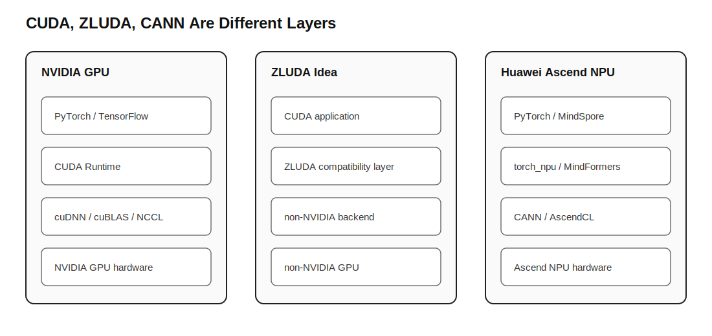

# LLM Systems and AI Chips Tutorial

这不是一份“名词解释大全”。它更像我给自己补课时会写的路线图：从 Hugging Face 上的开源模型开始，一路追到训练、LoRA 微调、推理服务、CUDA/ZLUDA/CANN，以及 AI 芯片为什么会影响模型速度。

第一版写得太像速成笔记，问题很明显：概念有了，但来源不够硬，工程细节也不够。现在这一版改成按官方文档、开源项目和论文来组织。每章尽量回答三个问题：

1. 这个东西在真实工程里处在哪一层？
2. 它解决什么问题，不解决什么问题？
3. 如果我要动手，第一步该看哪个项目、跑哪段代码？


## 先看哪几章

如果你只是想把 CUDA、ZLUDA、CANN 分清楚，读：

- [01. CUDA、ZLUDA 与昇腾 CANN](docs/01-hardware-stacks.md)
- [02. PyTorch、ONNX、safetensors 和 OM](docs/02-model-formats.md)

如果你想真的做一个 Hugging Face 大模型项目，读：

- [03. Hugging Face 项目从哪里开始](docs/03-huggingface-workflow.md)
- [04. SFT、LoRA、QLoRA、DPO 到底在训什么](docs/04-training-finetuning-alignment.md)
- [05. 推理优化和部署](docs/05-inference-optimization.md)
- [13. 模型评测与 Benchmark](docs/13-evaluation-benchmark.md)
- [14. 数据工程与数据清洗](docs/14-data-engineering.md)

如果你想往芯片、异构计算、大模型系统方向靠，读：

- [06. 集成电路与 AI 芯片学习路线](docs/06-chip-domain-roadmap.md)
- [07. 练手项目与简历表达](docs/07-practice-projects.md)
- [17. 高级推理优化](docs/17-advanced-inference.md)
- [18. 分布式训练与并行策略](docs/18-distributed-training.md)

如果你想做能上线的应用，读：

- [15. RAG 与 Agent 工程](docs/15-rag-agent-engineering.md)
- [16. 量化专题](docs/16-quantization.md)
- [19. 大模型安全与上线运维](docs/19-safety-ops.md)
- [20. 论文阅读路线](docs/20-paper-reading-roadmap.md)

如果你想把 GitHub star 变成自己的学习路线，而不是收藏夹，读：

- [21. 从 100 个 Starred Repos 清洗知识地图](docs/21-starred-repo-knowledge-map.md)
- [22. Star 驱动的学习路线](docs/22-star-driven-learning-route.md)
- [23. 100 个 Starred Repos 全量索引](docs/23-starred-repo-index.md)
- [24. Source Reading Queue](docs/24-source-reading-queue.md)

## 目录

- [00. 学习地图](docs/00-learning-map.md)
- [00A. 资料来源地图](docs/00-source-map.md)
- [00B. 自我 Review 记录](docs/00-self-review.md)
- [01. CUDA、ZLUDA 与昇腾 CANN](docs/01-hardware-stacks.md)
- [02. PyTorch、ONNX、safetensors 和 OM](docs/02-model-formats.md)
- [03. Hugging Face 项目从哪里开始](docs/03-huggingface-workflow.md)
- [04. SFT、LoRA、QLoRA、DPO 到底在训什么](docs/04-training-finetuning-alignment.md)
- [05. 推理优化和部署](docs/05-inference-optimization.md)
- [06. 集成电路与 AI 芯片学习路线](docs/06-chip-domain-roadmap.md)
- [07. 练手项目与简历表达](docs/07-practice-projects.md)
- [08. Hands-on Labs](docs/08-hands-on-labs.md)
- [09. Source Reading Notes](docs/09-source-reading-notes.md)
- [10. vLLM Benchmark Guide](docs/10-vllm-benchmark-guide.md)
- [11. CUDA / CANN API Map](docs/11-cuda-cann-api-map.md)
- [12. ONNX -> ATC -> OM -> AscendCL](docs/12-onnx-atc-om-flow.md)
- [13. 模型评测与 Benchmark](docs/13-evaluation-benchmark.md)
- [14. 数据工程与数据清洗](docs/14-data-engineering.md)
- [15. RAG 与 Agent 工程](docs/15-rag-agent-engineering.md)
- [16. 量化专题](docs/16-quantization.md)
- [17. 高级推理优化](docs/17-advanced-inference.md)
- [18. 分布式训练与并行策略](docs/18-distributed-training.md)
- [19. 大模型安全与上线运维](docs/19-safety-ops.md)
- [20. 论文阅读路线](docs/20-paper-reading-roadmap.md)
- [21. 从 100 个 Starred Repos 清洗知识地图](docs/21-starred-repo-knowledge-map.md)
- [22. Star 驱动的学习路线](docs/22-star-driven-learning-route.md)
- [23. 100 个 Starred Repos 全量索引](docs/23-starred-repo-index.md)
- [24. Source Reading Queue](docs/24-source-reading-queue.md)
- [术语表](docs/99-glossary.md)
- [参考资料](docs/references.md)
- [论文笔记模板](papers/README.md)
- [后续项目清单](PROJECTS.md)

## 这份教程的主线



```text
Hugging Face Hub 负责模型和数据入口
Transformers / PyTorch 负责训练、微调和最小推理
PEFT / TRL 负责 LoRA、SFT、DPO 等训练套路
vLLM / TGI / TensorRT-LLM / CANN 负责部署和推理优化
CUDA 是 NVIDIA GPU 原生生态
ZLUDA 是 CUDA 兼容层，不是华为昇腾生态
CANN 是华为 Ascend NPU 原生生态
```

## 怎么验证自己真的懂了

读完以后，至少能回答这些问题：

- 为什么 LoRA 不是“重新训练整个模型”？
- 为什么 ONNX 更常用于部署，而不是大模型继续训练？
- 为什么 vLLM 能提高并发吞吐？
- CUDA kernel、Ascend C 自定义算子、PyTorch op 之间是什么关系？
- 华为昇腾 CANN 和 ZLUDA 为什么不是一回事？
- 一个 Hugging Face 模型 repo 里，`config.json`、tokenizer、`.safetensors` 分别负责什么？
- 怎么用一个小脚本测本地 vLLM 服务的 TTFT 和延迟？
- ONNX 转 OM 时，哪些问题属于导出失败，哪些属于 ATC 转换失败？
- 为什么评测集要分 dev、regression、holdout？
- RAG 的 indexing 和 retrieval/generation 为什么要拆开看？
- INT4、QLoRA、GGUF、KV cache quantization 分别在量化哪一部分？
- DDP、FSDP/ZeRO、tensor parallel、pipeline parallel 分别切了什么？
- prompt injection 为什么不能只靠 system prompt 解决？

如果这些问题答不清楚，先别急着往简历上堆“熟悉 CUDA/CANN/vLLM/LoRA”。先把一个小实验跑通，再写经历。
