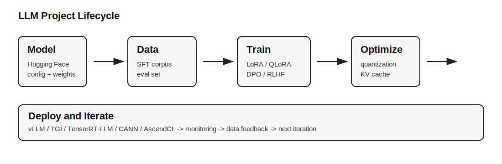

# LLM Systems and AI Chips Tutorial

一份面向初学者的中文学习教程，用通俗语言串起大模型、Hugging Face、PyTorch/ONNX、CUDA/ZLUDA、华为昇腾 CANN、训练、微调、推理优化和芯片计算生态。

这份教程的目标不是堆名词，而是回答一个实际问题：

> Hugging Face 上的开源大模型，到底怎样被下载、训练、微调、优化、部署到 GPU/NPU 上？



## 学习路线

1. 先理解硬件生态：GPU、NPU、CUDA、ZLUDA、CANN 分别是什么。
2. 再理解模型格式：PyTorch 模型、ONNX 模型、`.safetensors`、`.om` 文件分别用于什么。
3. 然后学习 Hugging Face 工作流：加载模型、准备数据、SFT、LoRA/QLoRA、评测。
4. 最后学习推理优化：量化、KV Cache、FlashAttention、vLLM、CANN/Ascend 推理部署。

## 目录

- [00. 学习地图](docs/00-learning-map.md)
- [01. CUDA、ZLUDA 与昇腾 CANN 的区别](docs/01-hardware-stacks.md)
- [02. PyTorch 模型、ONNX 模型和部署格式](docs/02-model-formats.md)
- [03. Hugging Face 大模型工作流](docs/03-huggingface-workflow.md)
- [04. 训练、微调、继续预训练与对齐](docs/04-training-finetuning-alignment.md)
- [05. 推理优化与部署](docs/05-inference-optimization.md)
- [06. 集成电路与 AI 芯片方向怎么学](docs/06-chip-domain-roadmap.md)
- [术语表](docs/99-glossary.md)
- [参考资料](docs/references.md)

## 推荐读法

如果你刚开始接触大模型工程，建议按顺序读。  
如果你已经会用 PyTorch/Hugging Face，可以从第 1、5、6 章开始看硬件和部署生态。

## 一句话总览


```text
Hugging Face 提供模型和工具
PyTorch 负责训练和微调
ONNX 更偏跨框架部署格式
CUDA 是 NVIDIA GPU 原生生态
ZLUDA 是 CUDA 兼容层
CANN 是华为昇腾 NPU 原生生态
vLLM/TensorRT/CANN 等工具负责让推理更快更省
```
