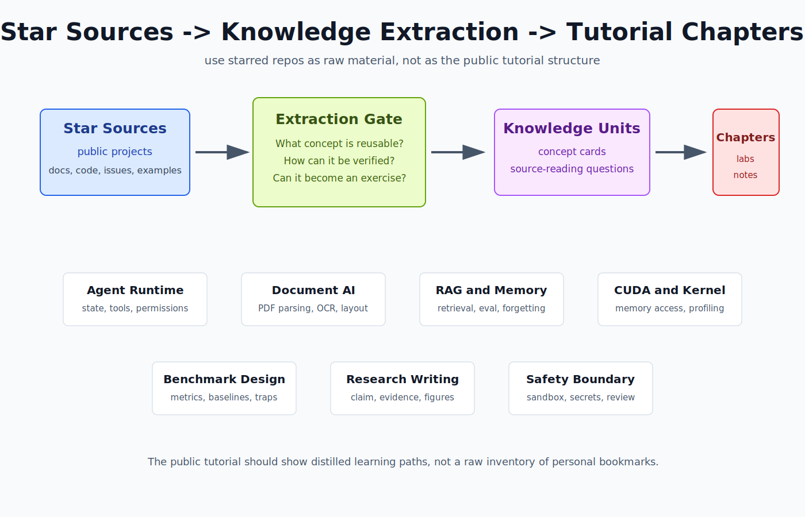

# 21. 从 Starred Repos 提取知识地图

这一章不展示收藏夹。GitHub star 只是原材料，真正有用的是从里面提取出的学习主题、工程问题和可验证练习。

我把这些项目按“能学到什么”重新分成七类。每一类都要落到一个输出物：概念图、实验记录、源码阅读笔记、测试清单或贡献计划。

## 1. Agent runtime

这一类项目关心的不是“AI 会不会写代码”，而是 AI coding agent 为什么能持续工作。

要学的知识：

- prompt、skill、tool call、MCP server、state file 分别承担什么职责。
- agent loop 怎么判断下一步是读代码、改代码、跑测试还是停下来。
- 什么信息应该进入长期记忆，什么信息只应该留在当前任务上下文里。
- 为什么需要 plan、review、verification，而不是直接让模型一路写。

代表来源：

- OpenAI Codex
- Anthropic Skills
- Model Context Protocol
- OpenCode / Archon / Superpowers 一类 agent harness

对应章节：

- [15. RAG 与 Agent 工程](15-rag-agent-engineering.md)
- [19. 大模型安全与上线运维](19-safety-ops.md)
- [24. Source Reading Queue](24-source-reading-queue.md)

验证方式：

- 画出一个 agent 执行任务的状态机。
- 写一页 tool boundary checklist。
- 解释为什么外部网页、PDF、README、issue 评论都不能当成用户指令。

## 2. 文档智能和资料入口

这一类项目解决“资料怎么进入模型”的问题。PDF、Office、网页、README 进模型之前，常常先坏在版面、表格、公式、引用和噪声上。

要学的知识：

- PDF parsing、OCR、layout detection、Markdown conversion 的差别。
- 为什么 LLM-ready Markdown 不是简单的纯文本抽取。
- 表格、公式、脚注、双栏论文、扫描件分别容易在哪里失败。
- 文档清洗结果如何进入 RAG、论文笔记和实验记录。

代表来源：

- MinerU
- MarkItDown
- PDFMathTranslate
- BabelDOC

对应章节：

- [14. 数据工程与数据清洗](14-data-engineering.md)
- [15. RAG 与 Agent 工程](15-rag-agent-engineering.md)
- [20. 论文阅读路线](20-paper-reading-roadmap.md)

验证方式：

- 选同一篇复杂 PDF，用两种工具转 Markdown。
- 标出公式、表格、图注、引用四类错误。
- 记录哪些错误会影响 RAG 答案，而哪些只是排版瑕疵。

## 3. RAG、memory 和知识库应用

这一类项目关心模型如何使用外部知识。真正要学的不是“接一个向量库”，而是检索、引用、记忆和权限边界。

要学的知识：

- indexing、chunking、embedding、rerank、generation 为什么要分开评估。
- memory 是结构化召回，不是无限追加聊天记录。
- 引用和证据链怎么验证。
- 找不到证据时如何拒答。

代表来源：

- Paper QA
- Langchain-Chatchat
- Supermemory
- LangBot

对应章节：

- [13. 模型评测与 Benchmark](13-evaluation-benchmark.md)
- [15. RAG 与 Agent 工程](15-rag-agent-engineering.md)
- [19. 大模型安全与上线运维](19-safety-ops.md)

验证方式：

- 建 20 条固定问答样例。
- 人工标注每条答案需要的证据片段。
- 比较不同 chunk size、top-k、rerank 设置下的失败案例。

## 4. CUDA、ZLUDA 和 kernel 阅读

这一类项目用来补系统性能和硬件生态。不要只背 CUDA、ZLUDA、CANN 的名字，要能读懂一个小 kernel 为什么快或慢。

要学的知识：

- grid、block、thread 和 memory hierarchy。
- global memory、shared memory、coalesced access。
- Tensor Cores、GEMM、FlashAttention 这类优化为什么和访存有关。
- ZLUDA 的定位是 CUDA 兼容层，不是 CANN，也不是通用推理框架。

代表来源：

- LeetCUDA
- ZLUDA
- gprMax 的 GPU/FDTD 代码

对应章节：

- [01. CUDA、ZLUDA 与昇腾 CANN](01-hardware-stacks.md)
- [06. 集成电路与 AI 芯片学习路线](06-chip-domain-roadmap.md)
- [11. CUDA / CANN API Map](11-cuda-cann-api-map.md)
- [17. 高级推理优化](17-advanced-inference.md)

验证方式：

- 读一个 CUDA kernel，写清输入、输出、线程映射和访存模式。
- 解释为什么相邻线程访问相邻地址通常更好。
- 把 kernel 层面的优化和 vLLM / FlashAttention 的系统优化联系起来。

## 5. 优化建模和工程约束

有些 starred repos 看起来和 LLM 没直接关系，但能训练一种很重要的工程能力：把现实限制写成约束，而不是靠感觉调参数。

要学的知识：

- 约束优化、调度、回测、交易费用、滑点、容量限制这些概念如何进入系统。
- benchmark 不是跑一次最快结果，而是固定场景、固定指标、可复现对比。
- 真实系统经常追求“可解释的稳健方案”，不是追求最花哨的架构。

代表来源：

- OR-Tools
- QuantLib
- vn.py / QUANTAXIS 这类量化框架

对应章节：

- [10. vLLM Benchmark Guide](10-vllm-benchmark-guide.md)
- [13. 模型评测与 Benchmark](13-evaluation-benchmark.md)
- [18. 分布式训练与并行策略](18-distributed-training.md)

验证方式：

- 把一次 vLLM 压测写成固定 scenario。
- 明确输入长度、输出长度、并发、硬件、模型、量化方式。
- 记录失败结果，不只记录最好结果。

## 6. 科研写作和图表生产力

这类项目可以提高论文阅读和写作效率，但不能替代证据链。好的工具应该让你更清楚地组织实验、图表和引用，而不是帮你写漂亮空话。

要学的知识：

- 一页论文笔记应该记录 problem、method、experiment、limitations。
- 图表的作用是减少理解成本，不是装饰。
- AI writing 工具只适合辅助结构、改写和检查，不适合替代研究判断。

代表来源：

- Papers We Love
- PaperBanana
- ChatPaper
- OpenPrism

对应章节：

- [20. 论文阅读路线](20-paper-reading-roadmap.md)
- [论文笔记模板](../papers/README.md)

验证方式：

- 选一篇 LLM systems 论文，写一页笔记。
- 单独复画一张结构图或实验表。
- 写清这篇论文能迁移到哪个工程实验。

## 7. 安全边界和风险隔离

star 列表里也会混进账号、代理、中转、注册、激活、抢票、逆向、安全资料。这些不能直接写成教程成果，但能提醒你：工程系统需要边界意识。

要学的知识：

- 工具能不能用，不只看技术上能不能跑，还要看授权、合规、风险和维护成本。
- Agent 读取外部内容时，要防 prompt injection。
- 逆向和安全资料适合训练系统理解，但公开教程不能写攻击型操作步骤。

代表来源：

- Web security / OSINT / reverse engineering 资料
- Android reverse engineering 工具
- 账号、代理、中转类项目作为风险样本

对应章节：

- [19. 大模型安全与上线运维](19-safety-ops.md)

验证方式：

- 写一个“不纳入教程主线”的判断清单。
- 对每个工具问：是否需要账号、是否绕过限制、是否可能伤害第三方、是否会泄漏数据。

## 最后怎么用这张图

以后再 star 项目时，不要只问“这个项目火不火”。问四个问题：

1. 它能解释哪个系统概念？
2. 它能不能变成一个可运行实验？
3. 它能不能帮我读懂一段源码？
4. 它有没有安全、授权或合规边界？

只有能回答前三个问题，并且第四个问题没有明显风险的项目，才值得进入教程主线。
