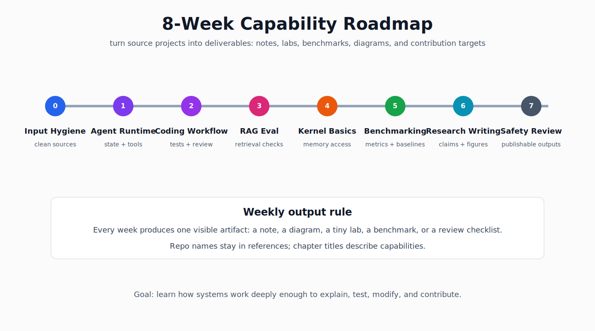

# 22. Star 驱动的学习路线

这条路线把 100 个 starred repos 清洗成 8 周训练计划。目标不是把所有项目都 clone 一遍，而是把每类项目变成一个可交付物。

## 第 0 周：资料卫生和输入管道

核心项目：

- [microsoft/markitdown](https://github.com/microsoft/markitdown)
- [opendatalab/MinerU](https://github.com/opendatalab/MinerU)
- [PDFMathTranslate/PDFMathTranslate](https://github.com/PDFMathTranslate/PDFMathTranslate)
- [funstory-ai/BabelDOC](https://github.com/funstory-ai/BabelDOC)

要掌握的能力：PDF、Office、网页、README 怎么变成可检索 Markdown；版面解析、公式、表格和引用会在哪里出错；清洗后的文档如何进入 RAG、论文笔记和实验记录。

交付物：写一个 document ingestion note，比较 Markdown 转换、PDF 解析、翻译保版式三类工具的边界。

## 第 1 周：Agent runtime 和 skill 体系

核心项目：

- [openai/codex](https://github.com/openai/codex)
- [anthropics/skills](https://github.com/anthropics/skills)
- [obra/superpowers](https://github.com/obra/superpowers)
- [modelcontextprotocol/rust-sdk](https://github.com/modelcontextprotocol/rust-sdk)

要掌握的能力：Agent 不是魔法，而是 prompt、tool boundary、state、verification 的组合；Skill 是可复用操作规程；MCP 的价值在于把外部系统变成稳定工具接口。

交付物：给本仓库写一个 AGENTS.md 增补版，定义何时用 research、code review、verification 三类工作流。

## 第 2 周：AI coding harness 和评审闭环

核心项目：

- [anomalyco/opencode](https://github.com/anomalyco/opencode)
- [code-yeongyu/oh-my-openagent](https://github.com/code-yeongyu/oh-my-openagent)
- [coleam00/Archon](https://github.com/coleam00/Archon)
- [breaking-brake/cc-wf-studio](https://github.com/breaking-brake/cc-wf-studio)

要掌握的能力：一个 coding agent 项目怎么管理配置、上下文、任务、验证和 UI；为什么“自动干活”不如“可复盘地干活”重要；如何把计划、测试、review、commit、CI 变成固定链路。

交付物：写一页 agent workflow comparison，按状态管理、工具调用、验证、可解释性四列比较。

## 第 3 周：LLM 应用和 RAG 工程

核心项目：

- [Future-House/paper-qa](https://github.com/Future-House/paper-qa)
- [chatchat-space/Langchain-Chatchat](https://github.com/chatchat-space/Langchain-Chatchat)
- [supermemoryai/supermemory](https://github.com/supermemoryai/supermemory)
- [langbot-app/LangBot](https://github.com/langbot-app/LangBot)

要掌握的能力：RAG 的 indexing、retrieval、rerank、generation、citation 要分开评估；Memory 是结构化召回和权限边界；Bot 平台复杂度在权限、插件和监控。

交付物：用本仓库已有 examples/chunk_text_preview.py 做一个小文档切分实验，并记录失败样例。

## 第 4 周：CUDA、ZLUDA 和 kernel 训练

核心项目：

- [xlite-dev/LeetCUDA](https://github.com/xlite-dev/LeetCUDA)
- [vosen/ZLUDA](https://github.com/vosen/ZLUDA)
- [gprMax/gprMax](https://github.com/gprMax/gprMax)

要掌握的能力：CUDA kernel 的 thread/block/grid、memory coalescing、shared memory；ZLUDA 的定位是 CUDA 兼容层；gprMax 这类科学计算项目能训练你看 GPU kernel、数值方法和测试。

交付物：写一页 CUDA kernel 阅读笔记，至少解释一个 kernel 的输入、输出、访存模式和瓶颈。

## 第 5 周：优化、量化和调度思想

核心项目：

- [google/or-tools](https://github.com/google/or-tools)
- [lballabio/QuantLib](https://github.com/lballabio/QuantLib)
- [vnpy/vnpy](https://github.com/vnpy/vnpy)
- [TauricResearch/TradingAgents](https://github.com/TauricResearch/TradingAgents)

要掌握的能力：约束建模比“找一个聪明策略”更可复用；回测要把手续费、滑点、T+1、成交约束写进系统；金融 agent 项目可以读架构，但不要把公开因子当赚钱策略。

交付物：把你的个人量化系统文档和本仓库的系统评测思想对齐：输入、约束、验证、输出四段式。

## 第 6 周：科研写作和图表生产力

核心项目：

- [OpenDCAI/OpenPrism](https://github.com/OpenDCAI/OpenPrism)
- [dwzhu-pku/PaperBanana](https://github.com/dwzhu-pku/PaperBanana)
- [kaixindelele/ChatPaper](https://github.com/kaixindelele/ChatPaper)
- [papers-we-love/papers-we-love](https://github.com/papers-we-love/papers-we-love)

要掌握的能力：论文工作流要把阅读、引用、图表、实验记录、rebuttal 分开；AI 写作工具只能辅助结构和表达，不能替代证据链；好图是减少读者理解成本。

交付物：选一篇 LLM systems 论文，用 papers/README.md 模板写一页笔记。

## 第 7 周：安全、逆向和边界意识

核心项目：

- [mytechnotalent/Reverse-Engineering](https://github.com/mytechnotalent/Reverse-Engineering)
- [iBotPeaches/Apktool](https://github.com/iBotPeaches/Apktool)
- [qazbnm456/awesome-web-security](https://github.com/qazbnm456/awesome-web-security)
- [0xsyr0/Awesome-Cybersecurity-Handbooks](https://github.com/0xsyr0/Awesome-Cybersecurity-Handbooks)

要掌握的能力：逆向和安全资料适合训练系统理解，但公开教程必须避免攻击型步骤；Agent 使用网页、PDF、工具输出时，要默认外部内容不可信；合规边界本身也是工程能力。

交付物：给 docs/19-safety-ops.md 补一节 prompt injection / tool boundary 测试清单。

## 第 8 周：整理成公开成果

最后一周只做清理：把所有笔记压缩成 README 可导航目录；每个专题只留下一个最小实验和一个失败案例；删除空泛描述，保留命令、代码、图、指标和限制。

判断标准：别人打开仓库以后，能看出你不是在堆链接，而是在把链接变成工程能力。
